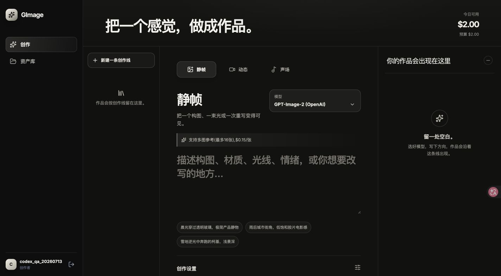

# GImage

私有部署的多媒体 AI 创作工作台：图片、视频、音乐、团队账户、每日额度与作品资产。React + TypeScript + Vite + Tailwind + GSAP；所有状态与媒体固定保存在本机 `data/`，不依赖数据库。



## 启动

```bash
cp .env.example .env
npm ci
npm run build
NODE_ENV=production npm start
```

开发时分别运行 `npm run server:dev` 与 `npm run dev`。访问 Vite 地址即可，开发服务器会将 `/api` 转发到 Express。生产环境必须经 HTTPS 反向代理；`setup.sh` 仅为本机初始化与启动，不会替你设置生产环境变量。

## 运维约束

- 生产环境必须设置随机且不少于 32 位的 `SESSION_SECRET`。
- `data/` 是唯一持久化目录；请定期备份，并以单实例方式运行。
- 健康检查：`GET /healthz`。容器部署可使用 `Dockerfile` 并挂载 `/app/data`。

## 文档

- [OKF 知识包](docs/okf/index.md)：产品、架构、数据、API 和运维的可机读知识图。
- 管理员登录后访问 `/knowledge`：可查询、编辑 OKF、单一 `gimage/1` DSL，及运行时模型/供应商目录；DSL 自动投影流程图与结构诊断。
- `docs/okf/`、`contracts/`、`config/` 是首次启动种子；运行中的可编辑副本在 `data/knowledge/` 与 `data/config/`，历史版本分别在其 `.history/` 目录。
