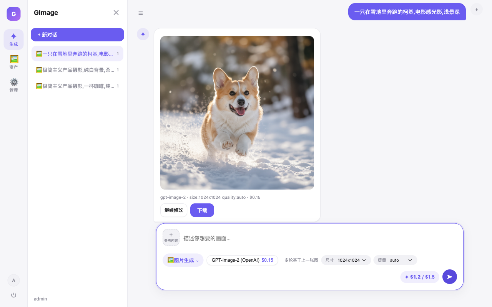

# GImage — 自托管多账户 AI 创作站

基于 [ZenMux](https://zenmux.ai) + [MiniMax](https://api.minimax.io) 的图片 / 视频 / 音乐生成网页工具,UI 参考「即梦」。管理员创建账户分给朋友用,按天设美元额度,不依赖数据库,数据全部存在本地 `data/` 目录。



## 功能

- 🎨 **图片生成**:GPT-Image-2 / Nano Banana 2 / Nano Banana Pro / Qwen-Image,支持多图参考、多轮编辑
- 🎬 **视频生成**:Seedance 2.0,文生视频 / 图生视频,异步任务
- 🎵 **音乐生成**:MiniMax Music,歌词 + 风格描述生成完整歌曲
- 👤 多账户 + 每日美元额度,管理后台查看用量与花费
- 🖼️ 统一资产库,按日期分组,支持批量下载 / 删除

## 快速开始

```bash
bash setup.sh
```

脚本会引导填入 ZenMux / MiniMax 密钥,自动生成管理员账号和随机密码,装依赖并可直接启动。密钥都可以留空跳过对应功能。

也可以手动配置:

```bash
npm install
cp .env.example .env   # 填入密钥、管理员账号、端口
npm start
```

## 使用

1. 管理员在「管理」页新建账户(用户名 / 密码 / 每日额度),把账密发给朋友。
2. 工作台选模式(图片 / 视频 / 音乐)→ 选模型 → 输入提示词 → 生成,可加参考图。
3. 每次生成按模型单价从当日额度扣费,次日 0 点自动重置,具体价格见 `config/models.json`。

## 部署

```bash
npm i -g pm2
pm2 start server.js --name gimage
```

建议前面挂 Nginx + HTTPS 反向代理。备份只需定期拷贝 `data/` 目录。

## 注意

生成调用 ZenMux / MiniMax 真实接口,需要账户里有余额或额度;报错信息会原样透传到前端,方便排查(常见:key 无效、余额不足)。
